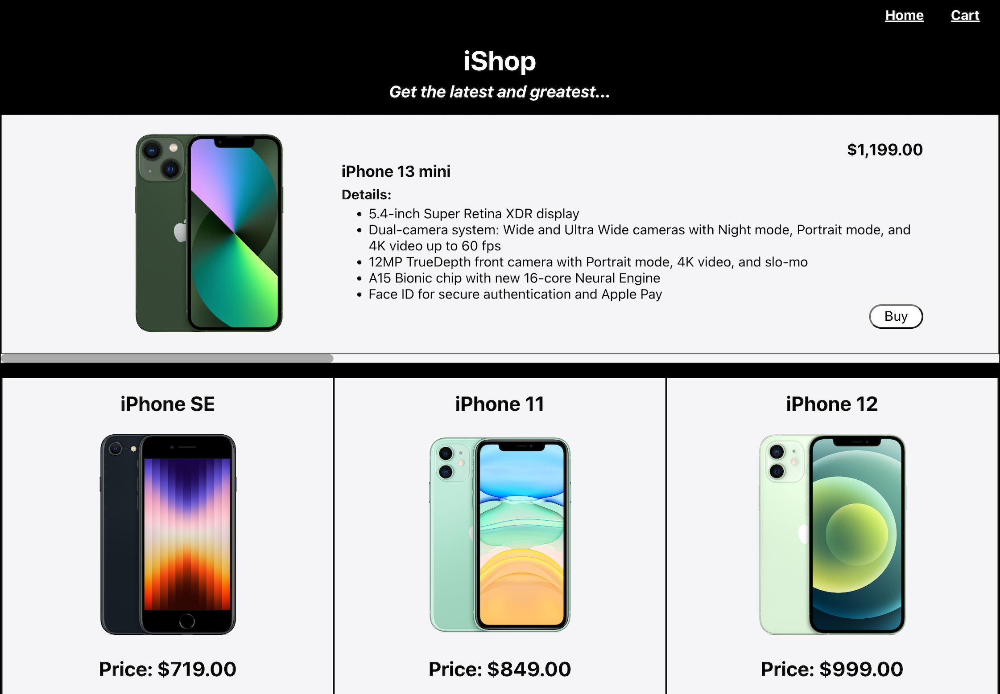

# React e-Shop Website

## Description

An e-commerce website with simple styling using React, React-Router-Dom and product data stored in Firestore. Featuring home, product and cart pages, with a cart system. Home page has a carousel displaying featured products, and a grid of products displayed from cheapest to most expensive.

## Possible future features

-   Favourites page
-   Search bar
-   Cart item count displayed next to cart
-   Multiple photos on product page
-   Photo changes with colour selection
-   Add more products to database

## Project Brief

Create an e-commerce site scoped to one category of products.

### MVP

1. At a minimum your e-shop website should have three pages:

    - Home Page

        - A Grid of products
        - Carousel of featured products

    - Product Page (with id parameter)

        - displays product details and options
        - allows you to add to cart and select product variants

    - Cart Page and system
        - List of products in cart
        - Ability to change quantity of products in cart
        - Ability to remove items from cart
        - Logic to prevent users from adding items to cart that are no longer in stock.

1. All data should be stored in Firestore and fetched by the frontend.

    - Store the following information:
        - quantity
        - variants (could be colors, sizes, etc)
        - price per unit
        - name
        - image url
        - favourited or not (boolean)
